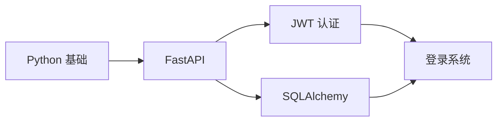

# weekly-synthesis — 深度周总结

## 目的

替代当前 Mode 3 的浅层统计，生成有深度的每周学习总结，帮助用户建立知识体系。

## 与 Mode 3 的区别

| 维度 | Mode 3（原进度报告） | weekly-synthesis |
|------|---------------------|------------------|
| 内容 | 统计天数、领域分布 | 知识图谱、掌握度评估、下周计划 |
| 深度 | 浅层 | 深度分析 |
| 输出 | 列表 | 结构化报告 + 可视化建议 |

## 触发方式

```
用户说：
- "这周学了什么"（自动触发 weekly-synthesis）
- "周总结"
- "生成本周学习报告"
- 每周五自动提醒（如果配置了 cron）
```

## 报告结构

```markdown
# 本周学习总结（2026-06-15 ~ 2026-06-21）

## 📊 概览
- 学习天数：5 天
- 总笔记数：12 篇
- 主要领域：backend (60%), frontend (30%), devops (10%)

## 🧠 知识体系构建

### 已建立的知识节点


### 知识关联强度
| 知识对 | 关联强度 | 说明 |
|--------|----------|------|
| FastAPI ↔ JWT | ⭐⭐⭐⭐⭐ | 登录系统核心 |
| SQLAlchemy ↔ JWT | ⭐⭐⭐ | 用户表查询 |
| FastAPI ↔ React | ⭐⭐ | 前后端分离 |

## 💡 核心收获（Top 3）

### 1. JWT 认证流程
- **理解**：Token 生成 → 验证 → 刷新
- **应用**：实现了登录接口
- **未掌握**：Token 吊销机制（需下周深入）

### 2. FastAPI 依赖注入
- **理解**：Depends() 的工作原理
- **应用**：用装饰器实现权限检查
- **未掌握**：多层依赖的性能影响

### 3. SQLAlchemy ORM
- **理解**：模型定义 → 迁移 → 查询
- **应用**：设计了用户表结构
- **未掌握**：复杂查询优化

## 📈 掌握度评估

| 主题 | 掌握度 | 依据 |
|------|--------|------|
| Python 基础 | 🟢🟢 95% | 能给别人讲清楚，举出类比 |
| FastAPI | 🟢 80% | 能不看代码讲清楚原理 |
| JWT 认证 | 🟡 60% | 能实现但不懂安全细节 |
| SQLAlchemy | 🟡 50% | 只会基础 CRUD |
| React | 🔴 30% | 只会基础组件 |

## 🔍 知识盲区检测

基于本周学习，发现以下前置知识缺失：

1. **异步编程**（影响 FastAPI 性能优化）
   - 建议：下周学习 `async/await` 原理
2. **HTTP 协议细节**（影响 API 设计）
   - 建议：复习 HTTP 状态码、Header、Cookie

## 🎯 下周学习计划

### 主攻方向
- **异步编程**：理解事件循环、asyncio
- **JWT 安全细节**：Token 存储、XSS 防护

### 复习计划
- 周一：复习 FastAPI 依赖注入
- 周三：复习 JWT 流程（费曼学习法）
- 周五：完成本周未掌握的主题

### 实践项目
- 用 FastAPI + JWT 实现一个完整的用户系统（注册/登录/权限）

## 💬 对话质量分析

本周与 AI 的对话统计：
- 总对话数：23 次
- 平均对话长度：8 轮
- 提示词质量评分：⭐⭐⭐ (7/10)

### 提示词优化建议
1. **太模糊的提问**："帮我写登录" → 应改为"用 FastAPI 实现 JWT 登录，需要包含 token 刷新"
2. **缺少上下文**：AI 多次询问项目结构 → 应在提问前提供代码目录

## 🏆 成就解锁

- [x] 连续学习 5 天
- [x] 完成第一个 API 项目
- [ ] 连续学习 7 天（进行中）
- [ ] 完成 10 篇笔记（8/10）
```

## 可视化建议

在网页端，可以生成：

1. **知识图谱**（Mermaid 流程图）
2. **掌握度雷达图**（Chart.js）
3. **学习时间分布饼图**
4. **进步曲线**（每天掌握度变化）

## 配置项

在 `config.yaml` 中：

```yaml
advanced:
  weekly_synthesis: true  # 启用深度周总结
  weekly_report_day: friday  # 自动提醒日
```
